# Infra

My [NixOS](https://nixos.org/) infra managed with [Colmena](https://github.com/zhaofengli/colmena)

Notes: I have no fucking idea of what I'm doing. Use it at your own risk.



## Usage

Enter in the development environment:

```shell
$ nix develop
```

Update the inputs:

```shell
$ nix flake update
```

Deploy the config

```shell
$ colmena apply
```

## Sops

### Where the fuck did I backup my private key?

In your password manager, "Sops (age)" entry.

### Generate server public key

Get the public key:

```shell
$ ssh root@hiraeth.jtremesay.org cat /etc/ssh/ssh_host_ed25519_key.pub | ssh-to-age
```

Add it to `.sops.yaml` then recrypt `secrets/default.yaml`:

```shell
$ sops updatekeys secrets/default.yaml
```

### Update secrets file:

```shell
$ sops edit secrets/default.yaml
```

## Tailscale

```shell
tailscale up --login-server https://headscale.jtremesay.org
```

## Borgmatic

### Where the fuck did I backup the password?

In your password manager, "Borg backup (storage box)" entry.

## Reference

- [NixOS Options](https://nixos.org/manual/nixos/stable/options)
- [NixOS Search](https://search.nixos.org/options)
- [Home Manager](https://nix-community.github.io/home-manager/options.xhtml)
- [Colmena](https://colmena.cli.rs/unstable/)